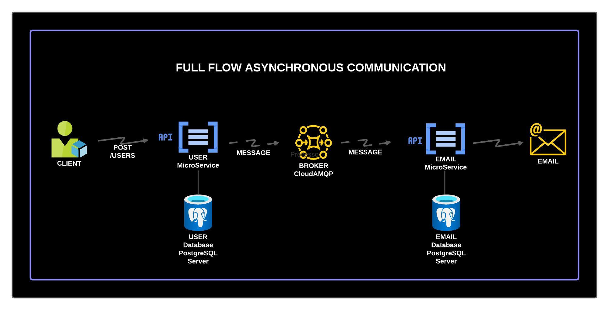

# User Management and Email Service System

This project is a software study solution involving two primary APIs, implemented using Spring Boot 3 and Java 17. The system is designed for managing users and sending emails asynchronously through RabbitMQ messages with CloudAMQP.

## Messaging Behavior Strategy

The core of this project is built upon a resilient message handling strategy that ensures reliability and robustness in asynchronous communication. Below are the key strategies implemented:

### Persistent Messages
Messages sent to RabbitMQ are marked as persistent, ensuring they are not lost during broker restarts and are stored on disk for durability.

### Durable Queues
Queues are declared as durable, which means they will survive a broker restart, preserving the state and contents of the queue.

### Manual Message Acknowledgments
Our consumer, the EmailService API, implements manual message acknowledgments, ensuring messages are only acknowledged after successful processing. This prevents message loss in case of service failures.

### Dead Letter Exchanges (DLX)
We utilize Dead Letter Exchanges for handling messages that cannot be processed immediately. Messages that fail to process or exceed a retry limit are rerouted to a designated DLX queue for further inspection or later reprocessing.

### Message Retry Mechanism
A retry mechanism with a delay is implemented for messages that fail to process. By utilizing the `x-dead-letter-exchange` and `x-message-ttl` queue arguments, we introduce a delay before a failed message is retried, allowing temporary issues to be resolved and maintaining the integrity of message processing.

These strategies form the backbone of our robust message-driven architecture, ensuring our services remain resilient and reliable.

The system is designed for managing users and sending emails asynchronously through RabbitMQ messages with CloudAMQP.

## Architecture Diagram

## System Components

### UserService API
- **Technology**: Java 17
- **Framework**: Spring Boot 3
- **Database**: PostgreSQL (`user_db`)
- **Primary Endpoint**:
  - **POST** `/user`: Endpoint for adding new users.

### EmailService API
- **Technology**: Java 17
- **Framework**: Spring Boot 3
- **Database**: PostgreSQL (`email_db`)

## Asynchronous Communication
The APIs communicate asynchronously via RabbitMQ, using CloudAMQP as the message broker.

### Workflow
1. **User Addition**:
   - An external client sends a request to add a new user via the `/user` endpoint of the UserService API.
   - UserService processes the request, persists user data in `user_db`, and notifies RabbitMQ about the new user's creation.

2. **Email Processing**:
   - EmailService listens to the RabbitMQ queue.
   - Upon receiving a message about a new user, it persists the information in `email_db`.
   - An email is then sent to the new user via SMTP, using Gmail's service.

## Configuration and Installation
*Detailed instructions.*
